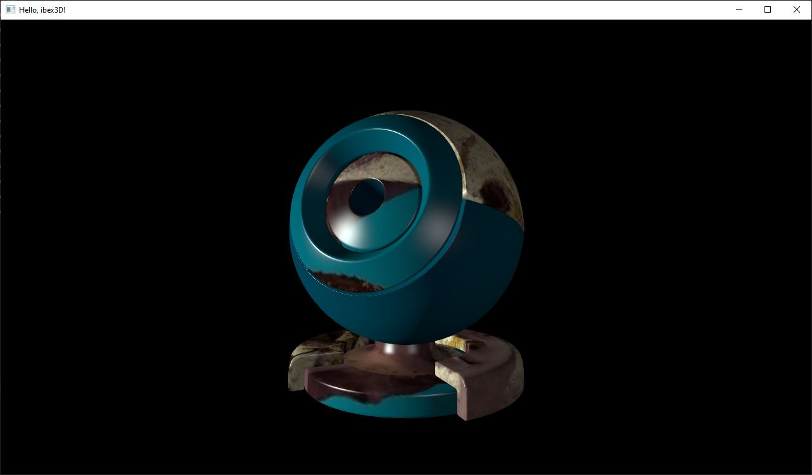

### ibex3D



Welcome! This is the repository for the game engine I'm trying to create, ibex3D. It is written in C++, uses the Win32 API for windowing, and the Vulkan API for graphics. It was originally based off of the Vulkan Tutorial by Alexander Overvoorde, but I've introduced some new features like diffuse and specular lighting, and also made some architectural changes to make it more my style. I want to look into other tutorials and learn more so that I can eventually keep improving it until it's capable of what I want to make with it in the future.

ibex3D is not even close to finished. I'm pretty sure this codebase has multiple issues that I'm not seeing yet, aside from the frankly horrible architecture.

### Table of Contents


### Requirements

* Windows 10 or 11 (x64) - Currently only supports the Windows operating system because it uses Win32-specific code. It's been tested on versions 10 and 11, but older/other versions might work as well. However, you NEED to run this with a machine with 64-bit support, as it does not have any 32-bit support.

* Vulkan Support - Exclusively uses the Vulkan graphics API. You'll need a graphics card with Vulkan support in order to be able to run it. This should be pretty common as Vulkan is widely supported by most modern GPUs.

* LunarG Vulkan SDK 1.4.341.0 - Uses the Vulkan SDK version 1.4.341.0, which you can download and install from [LunarXchange](https://vulkan.lunarg.com/sdk/home). You might be able to run it on other versions (I've personally run it back when it used version 1.3.296.0), but it's necessary that you have the Vulkan SDK installed on your machine. Please make sure that you have an environment variable `VULKAN_SDK` pointing to the Vulkan SDK (this should automatically be managed for you by the Vulkan SDK installer) as the Visual Studio project relies on this variable.

* Microsoft Visual Studio 2022 - Uses Microsoft Visual Studio Community 2022 version 17.14.27 and the Microsoft Visual C++ compiler, which you can download and install from [this link](https://visualstudio.microsoft.com/downloads/) (I haven't tested Visual Studio 2026 yet). I want to switch to using something like CMake one day and support different compilers, but I have no idea how to use those right now.

### Documentation

```
NOTICE: The documentation is *painfully* unfinished right now, but I'm adding more.
```

Very early work-in-progress documentation can be found in the [documentation folder](documentation/). I highly reccommend you start with the [START_HERE](documentation/_START_HERE.md) file, and once you're ready, explore the other files in the folder. If you want to create your own documentation, I've personally created a templates folder in order to make your life easier.

### Model file name notice

I renamed the main model file to `export3dcoat.obbj` (with two b's in the file extension) to get around the .gitignore, which seems to ignore all .obj files no matter if they're from Visual Studio or 3D modeling software. Please rename it to `export3dcoat.obj` (with a single b in the file extension)for the application to work correctly. This also applies to `testCube` and `testSphere.obbj`.

### Shader compilation notice

The shaders in the `ibex3D_sampleApplication/assets/shaders` folder have already been compiled to SPIR-V, and those SPIR-V files worked for me on two machines, but I'm not sure if they would work for you (I don't know if SPIR-V compilation output depends on your hardware and graphics drivers or not). If it doesn't work for you, try following these steps:

1. Go to `ibex3D_sampleApplication/assets/shaders/` and edit the `compile.bat` file inside.
2. Replace both occurences of `D:/VulkanSDK/1.4.341.1/Bin/glslc.exe` with the absolute path to glslc.exe in your Vulkan SDK installation (this would be `VulkanSDK/(version)/Bin/glslc.exe`).
3. Run `compile.bat` and see if you don't get any errors in the command line.

### Special Thanks

- alignment_police - Helped me with figuring out a possible memory leak in early development, and also taught me some stuff about custom memory management (which isn't really used here, but still).

- Drillgon200 - Helped me fix the view matrix and specular lighting implementation.

These individuals have helped me fix issues with the engine, and it arguably wouldn't be where it is now without their assistance. Thank you, mwah.
