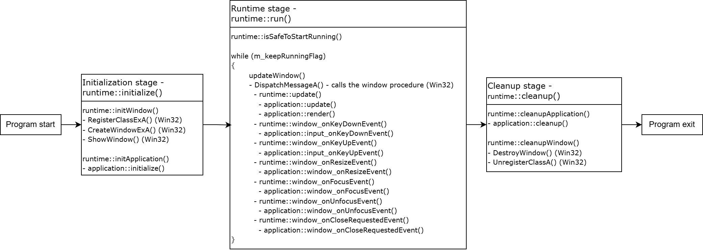

# runtime - Basic overview

- Header file: `include/ibex3D/core/runtime.h`
- Source file (Win32): `source/ibex3D/core/runtime_win32.cpp`

### Table of Contents

- [Description](#description)
  - [Execution stages](#execution-stages)
- [Functions](#functions)
  - [Public functions](#public-functions)
  - [Window procedure functions](#window-procedure-functions)
  - [Private functions](#private-functions)
- [Member variables](#member-variables)
- [Examples](#examples)

### Description

`runtime` is the class responsible for window creation and message handling, input processing, delta time calculation, and also owns an instance of the `application` and is responsible for calling its main functions. It represents the outermost execution layer of the application developed with ibex3D.

The entire execution of the ibex3D application consists of the following three stages: `initialization` -> `runtime` -> `cleanup`. Below is an explanation of the three stages and a diagram summing them up.

##### Execution stages

The initialization stage is used to set up the window, `application` and other main resources for the ibex3D application. It begins when the executable launches, and ends when all initialization succeeds or fails.

The runtime stage is used as a container for the entire period where the application is running. It should begin right after the initialization stage succeeds and end when the application should stop running (such as when the user clicks the window close button or the game exits automatically). Note that if the initialization stage is unsuccessful, this stage will be skipped and the program will skip directly to the cleanup stage by default.

The cleanup stage is used to free all allocated memory for the window, `application` and other main resources, as well as doing any other cleanup/procedures before exiting if needed. It begins right after the end of the runtime stage (or the initialization stage if it fails) and ends when all cleanup has proceeded, right before the executable closes.

Here is a diagram displaying all execution stages in order, as well as a simplified overview of what the stages entail:


### Functions

##### Public functions

`bool initialize(int wndWidth, int wndHeight, const char* wndTitle)`
- **Note: If this function fails, the window and application resources won't be freed automatically. You'll have to manually call the `cleanup()` function to do this.**
- Attempts to initialize the window and `application` instance, taking in the target width and height of the window as well as the title.
- Calls the `initWindow()` and `initApplication()` helper functions, and represents the entire length of the initialization stage mentioned in the description above.
- Returns true if both are successful and false otherwise.

`void run()`
- Begins the application update loop after checking that it is safe to do so, or immediately exits otherwise.
- Represents the entire length of the runtime stage mentioned in the description above.
- Continues executing for as long as the variable `m_keepRunningFlag` is true, and blocks further execution until `m_keepRunningFlag` is set to false.

`void forceClose()`
- Forcibly ends the processing loop and destroys the window, immediately ending the runtime stage and exiting the ibex3D application.
- This is not to be confused with `cleanup()`, which frees all memory allocated by the window and application after the application runtime ends.

`void cleanup()`
- Attempts to free any memory which may be allocated by the window and application.
- Calls the `cleanupApplication()` and `cleanupWindow()` helper functions, and represents the entire length of the cleanup stage mentioned in the description above.
- This is meant to be called after the runtime stage ends. Please see the example below for an example of how this should be done.

##### Window procedure functions

> DISCLAIMER: These functions are meant to be called by the window procedure or the `runtime` itself, not the user. The reason why they are public is because it would otherwise be difficult for the window procedure to access them in a platform-agnostic way. Aside from `void update()`, I highly recommend you don't touch these functions or their call sites unless necessary.

`void update()`
- Calculates the delta time, which is the time elapsed between the start and end of the previous frame, and uses it to call the `application`'s `update()` and `render()` functions.
- If the escape key is detected to be pressed, it immediately ends the runtime stage and exits the application. You can remove this piece of code if you want and replace it with a pause menu or your own quitting functionality.

`void window_onKeyDownEvent(unsigned int key)`
- Sends an event to the `application` signaling that a specific keyboard key was just pressed by the user.

`void window_onKeyUpEvent(unsigned int key)`
- Sends an event to the `application` signaling that a specific keyboard key was just released by the user.

`void window_onResizeEvent()`
- Sends an event to the `application` signaling that the window was just resized by the user, with the new dimensions of the window passed in as arguments.

`void window_onFocusEvent()`
- Sends an event to the `application` signaling that the window has just gained user focus.

`void window_onUnfocusEvent()`
- Sends an event to the `application` signaling that the window has just lost user focus.

`void window_onCloseRequestedEvent()`
- Sends an event to the `application` signaling that the user has just clicked the window close button.
- This is not to be confused with the "cleanup" functions, which are meant to free most allocated memory in the cleanup stage, although the onCloseRequested event can also be used to free memory in the application.

##### Private functions

`bool initWindow(int wndWidth, int wndHeight, const char* wndTitle)`
- **Note: If this function fails, the window resources won't be freed automatically. You'll have to manually call the `cleanupWindow()` function to do this.**
- Attempts to create the window used for displaying the application's graphics and shows it to the screen.
- Takes the target initial width and height of the window, as well as the text that should be displayed on the title bar.
- Returns true if all stages of the window initialization were successful, and false otherwise.

`void updateWindow()`
- Handles the window's internal message processing and event handling.
- This is not to be confused with `update()`, which calculates the delta time and updates the `application` using it.

`void cleanupWindow()`
- Frees all memory allocated by the window.

`bool initApplication(int wndWidth, int wndHeight)`
- **Note: If this function fails, the application resources won't be freed automatically. You'll have to manually call the `cleanupApplication()` function to do this.**
- Attempts to create and initialize the `application` instance.
- Returns true if successful and false otherwise.

`void cleanupApplication()`
- Calls the `application`'s cleanup() function, and then deallocates the instance memory.

`bool isSafeToStartRunning()`
- This is a helper function which decides if the application can safely start running by checking if all necessary member variables are initialized (not `nullptr`).
- Returns true if the application can safely start running, and false otherwise.

### Member variables

`void* m_windowData`
- The memory address to the window data struct instance, which contains platform-specific data like `HINSTANCE` and `HWND` on Win32.
- The reason why this is a `void*` is to make it easier to use a different window data struct depending on the platform, without exposing platform-specific information to the scope of the header file or wherever it's included.
- Different source files for `runtime` are for different platforms, and thus contain information specific to those different platforms.

`application* m_application`
- A pointer to the `application` instance, which is allocated on the heap.

`std::chrono::high_resolution_clock::time_point m_startTime`
- The variable recording the exact time when the current loop of the application processing loop begins.
- This is used for the delta time calculation in the `update()` function.

`bool m_keepRunningFlag`
- The variable which controls whether the application processing loop should continue or stop immediately.
- This is set to true when the application should keep running, and false when it should quit.

### Examples

How to initialize, run and cleanup an runtime instance (as used in the entry point file, `source/sampleApp/main.cpp`)
```cpp
#include <ibex3D/core/entryPoint.h>
#include <ibex3D/core/runtime.h>

int ibex3D_entryPoint()
{
	// Start of program execution and initialization stage

	auto pRuntime = new runtime;
	if (pRuntime->initialize(1280, 720, "Hello, ibex3D!")
	{
		// End of initialization stage, start of runtime stage
		pRuntime->run();
		// End of runtime stage, start of cleanup stage
	}

	pRuntime->cleanup();
	// End of cleanup stage

	delete pRuntime;
	pRuntime = nullptr;

	// End of program execution
	return 0;
}
```